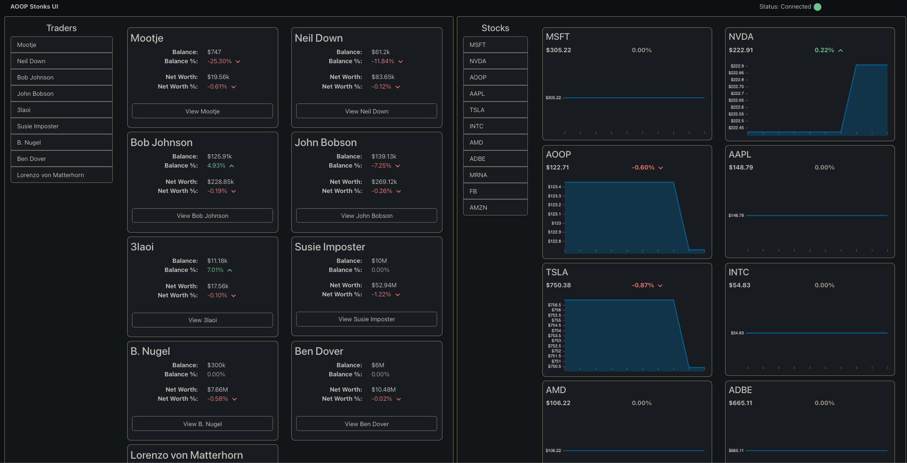

 

  <h1 align="center">Stock Market Simulation</h1>

## About The Project

<!-- Add short description about the project here -->
This project was done as part of my university project in the Advanced Object Oriented Programming course.

This projects involves a stock market simulation betweeen traders and the stock market. Each trader can make an order(buy or sell)
and the stock market can handle these requests, updating the information. This is done via the client-server model using a network.
Also, this program runs on multiple threads resulting a better performance.

## Installation

To get a local copy up and running follow these simple steps.

### Prerequisites

* [Java 17](https://www.oracle.com/java/technologies/javase/jdk17-archive-downloads.html) or higher
* [Maven 3.6](https://maven.apache.org/download.cgi) or higher
* [Docker](https://www.docker.com/)
* [Docker-Compose](https://docs.docker.com/compose/install/)

### Steps

<pre>
git clone https://github.com/manos02/stock-market-simulator.git
cd stock-market-simulator
docker-compose up --build
</pre>
Navigate to http://localhost:3000/

NOTE: If there is a problem, open docker application and run trade-application container manually.

## Modules

The program has 4 main modules: stock-exchange, trading, network, message-queue.

Stock-exchange: This module handles all the operations of the stock market and facilitates interactions between traders and the server. 
It is responsible for setting up the server and handling client connections through client-server communication. It is responsible for sending 
updates to the traders module continuously, through the StockApplication class. It also handles orders that are received
by the traders and ensures that orders are executed correctly based on the type of each order. Furthermore, it can resolve orders with each other
and update the relevant parties involved in each transaction. This is done by matching buy and sell orders to complete transactions. Endly it
maintains the transaction history for each trader and the order book.

Trading: This module handles all the operations of the traders and the orders. It is responsible for linking each trader with a client
and connect it to the stock-exchange module through the server. Each trader can handle updates from the stock market about themselves and the stocks. 
Also, each trader is continuously making an order with a random trading strategy, which is then sent to the stock market through the network.
When a trader's transaction is resolved, he immediately gets an update from the stock market and his assets are set appropriately.  

Network: This module handles all the operations of the client-server model. Firstly it sets up the server which has the ability
to handle multiple clients simultaneously. To achieve this, it spawns a new client handler for each incoming client connection.
This architecture ensures that the server can manage and serve a large number of clients concurrently. Also, the network module
facilitates communication between clients and the server. It can handle the exchange of data using message objects that are 
converted to json strings. For the stock market it is essential for transmitting orders from traders to the stock market, 
updating traders with market information, and managing various interactions within the system.

Message-queue: This module handles the message queues and their operations. It also facilitates the message class which is the 
outer layer of all the data sent over the network and encapsulates data and commands in the stock market simulation.
Messages can be easily converted to strings using Gson, making them suitable for transmission over the network
and back to message objects when they arrive to their destination.

